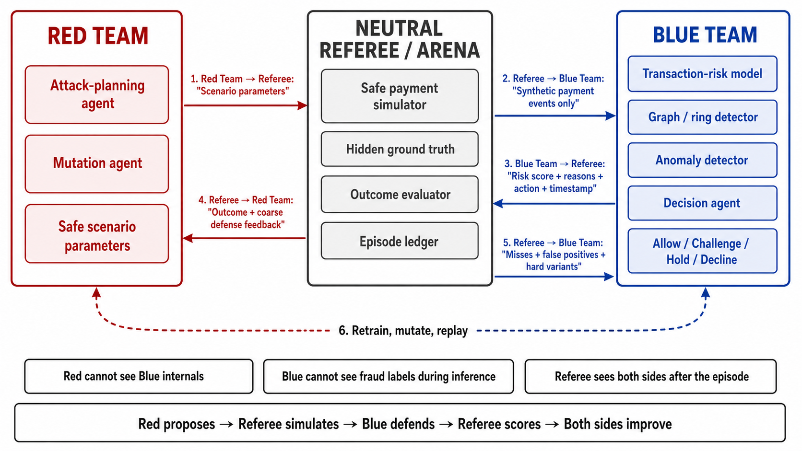
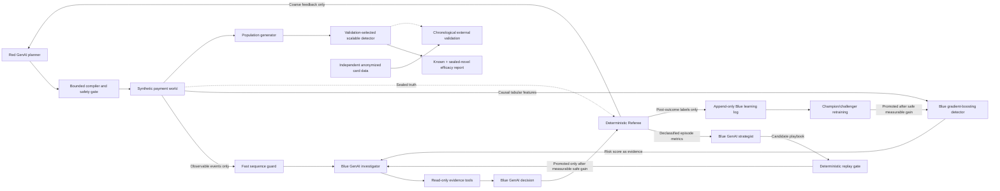

# MasterGuard AI - *Attack. Adapt. Defend.*

**An open-model adversarial AI lab for payment security. Red GenAI designs the attack, Blue GenAI investigates and responds, and a neutral Referee measures who won.**

MasterGuard AI is a working web prototype for the Mastercard Innovation Challenge 2026. It safely recreates GenAI-enabled fraud behavior inside a synthetic payment world; it does not connect to payment rails, contact real users, or generate operational fraud content.



## What the prototype demonstrates

1. A source-backed Threat Atlas identifies 31 GenAI-enabled vectors across nine executable families, seven payment rails and all three lifecycle phases.
2. A Red GenAI agent creates a bounded synthetic campaign from an approved attack card.
3. A deterministic compiler and safety gate reject unsupported stages, parameters, identities and actions.
4. A population generator materializes reproducible customer behavior, attack sequences, verified edge cases and family-specific look-alikes at scale.
5. The simulator separates Blue-visible events from sealed truth and creates entity-isolated train, validation, known-test and novel-vector-test splits.
6. A fast sequence guard and Blue-only gradient-boosting detector score causal, observable signals before any model call.
7. A Blue GenAI Investigator consumes those scores as evidence, selects read-only tools and chooses `allow`, `monitor`, `step_up`, `hold` or `block` without undercutting the guard.
8. The detector is selected on validation only and reports PR-AUC, precision, recall, F1, false-positive rate and value-weighted recall on sealed tests.
9. An independent chronological test on public, real, anonymized card transactions measures performance beyond the simulator, with confidence intervals, calibration and drift diagnostics.
10. A deterministic Referee scores timing, protected value, false positives and customer friction.
11. Red receives only coarse feedback and may adapt the next bounded campaign.
12. A Blue Strategist proposes an evidence playbook; the Referee promotes it only after safer replay gains.
13. The MasterGuard AI web prototype presents Identify, Generate, Defend and independent-validation evidence plus the live Red-versus-Blue Agent Arena.

The Arena is an adversarial GenAI loop with a two-speed Blue defense. Red Qwen plans and adapts bounded attacks. Blue's gradient-boosting detector performs high-throughput tabular screening, while Blue Qwen performs evidence-grounded investigation, mitigation and strategy. The detector is not part of Red and its scores, features, threshold and weights never cross the Referee boundary.

## Architecture and information boundaries



- **Red** sees researched attack cards, allowed mutations, difficulty and coarse feedback.
- **Blue detector** sees only a causal feature allowlist derived from current and prior observable events. It is fast, deterministic at inference and never receives answer-key fields.
- **Blue Agent** sees event types, synthetic attributes, visible history, tool evidence and the detector score. It never receives the attack family, fraud label, stage ID or intervention answer key.
- **Fast guard** uses no model and no sealed label. It enforces continuity and a minimum action from cross-phase evidence while Qwen performs the richer investigation.
- **Referee** alone can join Blue's decisions to sealed truth.
- **Blue Strategist** sees a declassified post-episode summary, proposes only approved evidence tools and defensive focus, and cannot promote its own proposal.
- **Population detector** learns only sanitized observables. Fraud labels, family/vector IDs, case IDs, scenario IDs and split identities are forbidden features.

Read [the detailed v2 architecture](docs/agentic-v2.md) for the contracts, scoring policy and deployment shape.

## Included attack families

| ID | Synthetic campaign | Main lifecycle coverage |
|---|---|---|
| `AGENT-01` | Agentic-commerce intent and checkout manipulation | Agent recognition through merchant receipt |
| `APP-01` | GenAI-amplified authorized push-payment scam | Pre-transaction and transaction |
| `ATO-01` | GenAI-assisted account takeover and rapid transfer | Pre-transaction through containment |
| `BEC-01` | Supplier impersonation and payment diversion | Pre-transaction and transaction |
| `MULE-01` | AI-coordinated mule fan-in and dispersal | Transaction and post-transaction |
| `SYNID-01` | Synthetic-identity onboarding and activation | Pre-transaction and early transaction |
| `EVADE-01` | Feedback-guided low-and-slow payment evasion | Pre-transaction through post-transaction dispersal |
| `PAYOUT-01` | Merchant payout destination manipulation | Pre-transaction through post-transaction settlement |
| `DISPUTE-01` | Dispute evidence and refund abuse | Transaction and post-transaction |

The nine cards cover agentic commerce, social engineering, account takeover, business-payment diversion, mule networks, synthetic identity, adaptive evasion, merchant payout abuse, and dispute/refund abuse. The Threat Atlas expands them into 31 source-backed vectors over seven rails, 14 channels and 13 social-engineering surfaces. They materialize 24 observable event types, 27 family-specific legitimate look-alikes, and all three payment-lifecycle phases. All identifiers, accounts, devices, beneficiaries, payments and timestamps are synthetic.

## How the solution answers the judging criteria

| Criterion | Evidence in the running prototype |
|---|---|
| Diversity of attacks | 31 researched vectors, nine executable families, seven rails, 14 channels, 13 social surfaces, source provenance, confidence, plausibility and novelty. |
| Fidelity of simulation | Reproducible populations, customer baselines, correlated rail/channel/auth behavior, legitimate edge cases, signal-sparse hard attacks, family-specific look-alikes, sequence checks and sealed truth. Fidelity is measured against declared priors—not misrepresented as live-network similarity. |
| Detection efficacy | A validation-selected scalable detector reports hidden-test PR-AUC, precision, recall, F1, false-positive rate and value-weighted recall. A separate real-data validation reports uncertainty, calibration and drift. The Qwen agent adds evidence-led explanation, action and lifecycle mitigation. |
| Novelty | GenAI Red versus GenAI Blue, separate Blue strategy learning, guarded dual feedback loops, agentic-commerce threat coverage, and a two-speed data-plane/control-plane defense. |
| Live-payment feasibility | Every event declares its source system, placement lane and latency budget. The deterministic minimum-action guard can sit on the inline path; verified legitimate context can exit without a model call; the remaining investigation and decision share one Qwen call per event. |

The UI reads versioned Threat Atlas and benchmark artifacts generated by the same repository. It does not rely on static marketing scores.

## Quick start: Ollama and Qwen

This is the recommended way to run MasterGuard AI on a laptop. The application does **not** download or start a model automatically; install and start Ollama first.

### Prerequisites

- Python 3.11 or newer
- Git
- [Ollama](https://ollama.com/download) for macOS, Windows or Linux
- Enough local memory for the model you select

### 1. Clone the repository

```bash
git clone https://github.com/u367403_ual/mc-hackathon.git
cd mc-hackathon
```

### 2. Create the Python environment

macOS or Linux:

```bash
python3 -m venv .venv
source .venv/bin/activate
python -m pip install --upgrade pip
python -m pip install -r requirements.txt
```

Windows PowerShell:

```powershell
py -3.11 -m venv .venv
.\.venv\Scripts\Activate.ps1
python -m pip install --upgrade pip
python -m pip install -r requirements.txt
```

### 3. Install a Qwen model

The recommended default is Qwen 3.5 9B:

```bash
ollama pull qwen3.5:9b
```

The Ollama package is approximately 6.6 GB. For a smaller local download, use:

```bash
ollama pull qwen3.5:4b
```

On macOS and Windows, the Ollama application normally runs its server in the background. On Linux or a manual installation, start it in a separate terminal if needed:

```bash
ollama serve
```

Verify that the server and model are available:

```bash
ollama list
curl http://127.0.0.1:11434/v1/models
```

Ollama exposes an [OpenAI-compatible chat-completions API](https://docs.ollama.com/api/openai-compatibility), which is the interface MasterGuard AI uses.

### 4. Confirm the model selected by MasterGuard AI

With Ollama running and no model environment variables set:

```bash
python -m sentinelloop config
```

Expected shape:

```json
{
  "model_base_url": "http://127.0.0.1:11434/v1",
  "red_model_id": "qwen3.5:9b",
  "blue_model_id": "qwen3.5:9b",
  "structured_output_mode": "json_schema"
}
```

MasterGuard AI prefers an installed `qwen3.5:9b`, then another Qwen 3.5 or Qwen Coder model, and finally any installed model whose name contains `qwen`.

### 5. Train the Blue real-time detector

The generated champion is local and intentionally ignored by Git. Train it once before starting the hybrid Arena:

```bash
python scripts/train_detector.py --seeds-per-cell 8
```

For a faster development smoke test, use `--seeds-per-cell 2`. The report is written to `data/loop/detector_report.json` and the champion to `data/loop/models/champion/model.joblib`.

The detector is enabled by default. If its model file is missing or incompatible, MasterGuard records the fallback and safely runs Blue in sequence-guard-plus-Qwen mode. To disable ML explicitly, set `ML_DETECTOR_ENABLED=0`.

### 6. Start the web application

```bash
python -m app.server
```

Open [http://127.0.0.1:8501](http://127.0.0.1:8501).

Use the HTTP address above. Opening `app/templates/lab.html` directly with a `file://` URL bypasses the Python service and cannot run a battle.

The **Identify**, **Generate** and **Defend** sections work immediately from the included reproducible benchmark. Starting a live Agent Battle additionally requires the configured Qwen endpoint.

For your first test, select:

- Attack family: `ATO-01`
- Difficulty: `Medium`
- Feedback rounds: `1 round`

Then choose **Start agent battle**. One round is the fast demonstration path. Blue combines investigation and decision in one Qwen call per unresolved event, resolves independently verified low-risk events without Qwen, and evaluates the isolated attack and look-alike cases with bounded concurrency. Runs with two or more rounds also replay-test a Blue defense candidate between rounds and therefore take longer; use them when demonstrating the learning loop rather than for every development check.

After a new battle, the report first shows the five submission criteria, balanced lifecycle defense score and weakest phase, then separate pre-transaction, transaction and post-transaction cards. The capability-versus-consequence view distinguishes a weak attack from a capable attack that Blue successfully contained. Select any replay event to inspect the source stream, live-payment lane, fast-guard risk synthesis, Blue evidence tools, reason codes, action and mitigation.

Every completed Referee round appends post-outcome rows to `data/loop/training_log.jsonl`. Automatic retraining is deliberately disabled in the fast UI path because it adds latency. For a dedicated multi-round learning demonstration, set `BATTLE_RETRAIN_EVERY=2`; a challenger is promoted only after measurable improvement while recall and legitimate-customer safety remain inside strict tolerances.

### Why the gradient-boosting model is Blue-only

- Red's job is to create and adapt plausible bounded attacks, not classify them.
- Blue needs a fast, stable tabular signal before the slower contextual Qwen investigation.
- Red receives only coarse Referee outcomes, never Blue's exact score, threshold, features or model weights.
- Blue training labels are written only after the Referee opens sealed truth, so the live decision cannot read its own answer key.

## Explicit model selection

Automatic detection is convenient, but every model setting can be supplied explicitly. This also lets Red and Blue use different models.

macOS or Linux:

```bash
export MODEL_BASE_URL=http://127.0.0.1:11434/v1
export MODEL_API_KEY=ollama
export RED_MODEL_ID=qwen3.5:9b
export BLUE_MODEL_ID=qwen3.5:9b
export MODEL_STRUCTURED_OUTPUT_MODE=json_schema
python -m sentinelloop config
python -m app.server
```

Windows PowerShell:

```powershell
$env:MODEL_BASE_URL = "http://127.0.0.1:11434/v1"
$env:MODEL_API_KEY = "ollama"
$env:RED_MODEL_ID = "qwen3.5:9b"
$env:BLUE_MODEL_ID = "qwen3.5:9b"
$env:MODEL_STRUCTURED_OUTPUT_MODE = "json_schema"
python -m sentinelloop config
python -m app.server
```

Model guidance:

| Choice | When to use it |
|---|---|
| `qwen3.5:4b` | Faster or memory-constrained local demonstrations |
| `qwen3.5:9b` | Recommended balance for the full agent flow |
| A larger Qwen model | Stronger reasoning when the machine has sufficient GPU/memory capacity |
| Separate Red and Blue models | Comparative model experiments |

The configured server must implement `POST /v1/chat/completions`. `json_schema` is preferred. If a compatible server supports only JSON-object output, set `MODEL_STRUCTURED_OUTPUT_MODE=json_object`; use `prompt` only as a last-resort compatibility mode.

## vLLM and NVIDIA GPU deployment

MasterGuard AI also includes a two-service Docker Compose configuration:

```text
Public web container → Private Qwen/vLLM container
```

Requirements:

- Docker with Compose
- An NVIDIA GPU
- NVIDIA Container Toolkit configured for Docker
- Sufficient GPU memory/model storage for `Qwen/Qwen3.5-9B`

Start both services:

```bash
export MODEL_API_KEY=choose-a-private-random-value
docker compose -f deploy/docker-compose.qwen.yml up --build
```

Then open [http://127.0.0.1:8501](http://127.0.0.1:8501). The web image trains and embeds a reproducible Blue detector during its build; no generated model is committed to Git. The first model-service startup downloads Qwen and will take longer. The Compose file uses the official `vllm/vllm-openai` image; see the [vLLM Docker guide](https://docs.vllm.ai/en/stable/deployment/docker/) and [OpenAI-compatible server documentation](https://docs.vllm.ai/en/latest/serving/online_serving/openai_compatible_server/).

For a public deployment, expose only the web service. Keep vLLM private behind a network boundary or reverse proxy; an API key alone is not a complete perimeter.

## Run from the command line

With the model endpoint running:

```bash
python -m sentinelloop run \
  --attack-family ATO-01 \
  --difficulty medium \
  --rounds 1 \
  --seed 20260824
```

The complete audit record is written to `runs/agentic/latest.json` by default. The `runs/` directory is intentionally ignored by Git because it is generated locally.

Run a live multi-scenario benchmark against the configured Qwen endpoint:

```bash
python -m sentinelloop benchmark \
  --families AGENT-01 ATO-01 EVADE-01 PAYOUT-01 \
  --difficulties medium hard
```

For the full matrix, omit `--families` and use `--difficulties easy medium hard`. This performs many sequential model calls; start with a small subset. The result is saved to `runs/agentic/benchmark.json` and reports detection, protected value, hard false positives, friction and lifecycle balance. Deterministic test gateways are never presented as model-efficacy results.

Run the population-scale Scenario Foundry and sealed detector benchmark without a model endpoint:

```bash
python -m sentinelloop population-benchmark
```

This writes inspectable artifacts to `data/benchmark/`: the event population, hidden-test predictions, metadata, data-quality report and benchmark metrics. Complete threat-vector IDs are withheld in `test_novel`, while validation alone selects the detector and threshold. See [the benchmark methodology](docs/benchmark-methodology.md) for the audit trail and exact reproduction command.

### Run the independent real-data validation

This optional check does not need Qwen. It uses the public, anonymized ULB/Worldline card-fraud dataset from [OpenML dataset 1597](https://www.openml.org/d/1597). Raw data and row-level predictions remain local and are ignored by Git.

```bash
python -m pip install -r requirements-validation.txt
mkdir -p data/external
curl -L --fail \
  --output data/external/creditcard.parquet \
  https://data.openml.org/datasets/0000/1597/dataset_1597.pq
python -m sentinelloop external-validate
```

The current reproducible future-test result is PR-AUC 0.7656, precision 0.8727, recall 0.6486, F1 0.7442, and false-positive rate 0.0124%, with 95% uncertainty intervals in the report. It is deliberately labeled **share with caveats**: the later half of the future window degrades, and the data cannot validate Qwen lifecycle reasoning or non-card rails.

Read [the independent validation report](docs/external-validation-report.md), inspect `data/external_validation/latest.json`, or install `requirements-audit.txt` and open [the executed audit notebook](notebooks/external_validation_audit.ipynb).

## Debug in VS Code

The repository includes a VS Code configuration named **MasterGuard AI Web — Guided Debug**.

1. Open the repository folder in VS Code.
2. Run **Python: Select Interpreter** and choose `.venv/bin/python` on macOS/Linux or `.venv\\Scripts\\python.exe` on Windows.
3. Open `app/server.py` and add a breakpoint inside `run_agent_lab()`.
4. Open **Run and Debug**, select **MasterGuard AI Web — Guided Debug**, and press `F5`.
5. Open `http://127.0.0.1:8501`, configure one round, and start a battle.

The debug profile enables `SENTINELLOOP_TRACE=1`. Trace lines show the Red call, safety gate, simulation, Blue tool selection, decisions, legitimate controls, Referee scoring and feedback release. Flask's auto-reloader is disabled in this profile so breakpoints remain attached to one process.

## Tests

Run the MasterGuard AI Agent Arena, population benchmark, data-quality and information-boundary tests:

```bash
python -m unittest \
  tests.test_agentic_loop \
  tests.test_config \
  tests.test_dashboard -v
```

Run the Red compiler and safety-gate tests:

```bash
python -m unittest discover -s red_team_agent/tests -v
```

Run every deterministic test in the main test directory:

```bash
python -m unittest discover -s tests -v
```

The deterministic suite includes MasterGuard AI Agent Arena, information-boundary, population, external-validation and dashboard checks. Test agents use fake model gateways and do not download or call Qwen.

## Configuration reference

| Variable | Default | Purpose |
|---|---|---|
| `MODEL_BASE_URL` | Auto-detected Ollama or `http://127.0.0.1:8000/v1` | OpenAI-compatible model base URL |
| `MODEL_API_KEY` | `local-development` | Server-side bearer token; ignored by local Ollama |
| `RED_MODEL_ID` | Auto-detected Qwen or `Qwen/Qwen3.5-9B` | Red planner model |
| `BLUE_MODEL_ID` | Auto-detected Qwen or `Qwen/Qwen3.5-9B` | Blue investigator/decision model |
| `MODEL_STRUCTURED_OUTPUT_MODE` | `json_schema` | `json_schema`, `json_object` or `prompt` |
| `MODEL_TIMEOUT_SECONDS` | `120` | Timeout for one model call |
| `MODEL_MAX_OUTPUT_TOKENS` | `1400` | Maximum generated tokens per call |
| `CASE_PARALLELISM` | `4` | Maximum isolated attack/control cases evaluated concurrently; set to `1` for a model server that already performs its own batching |
| `RED_AGENT_TEMPERATURE` | `0.65` | Red planning diversity |
| `BLUE_AGENT_TEMPERATURE` | `0.15` | Blue decision consistency |
| `ML_DETECTOR_ENABLED` | `1` | Enables the Blue-only gradient-boosting evidence layer when a champion model is available |
| `ML_MODEL_DIR` | `data/loop/models/champion` | Local champion detector directory |
| `BATTLE_TRAINING_LOG` | `data/loop/training_log.jsonl` | Append-only post-Referee Blue learning rows |
| `BATTLE_RETRAIN_EVERY` | `0` | Completed rounds per challenger retrain; `0` keeps retraining out of the fast UI path |
| `BATTLE_INCLUDE_AMBIENT` | `0` | Include ordinary and hard-negative traffic in live Referee scoring |
| `BATTLE_AMBIENT_SAMPLE` | `8` | Ordinary cases added when ambient evaluation is enabled |
| `BATTLE_TRAP_SAMPLE_EACH` | `2` | Look-alike cases per trap type when ambient evaluation is enabled |
| `APP_HOST` | `127.0.0.1` | Web bind address |
| `PORT` | `8501` | Web port |
| `FLASK_DEBUG` | `0` | Flask development debugger |
| `SENTINELLOOP_TRACE` | `0` | Structured terminal trace output |

`.env.example` documents the same variables. Export them in the shell, configure them in your hosting platform, or supply them through Docker Compose. Never commit a real `.env` or API key.

## Repository map

```text
sentinelloop/        Red, Blue, evidence tools, simulator, Referee and orchestrator
red_team_agent/      Source-grounded attack cards, compiler and safety gate
app/                 MasterGuard AI web application and compact deterministic legacy fallback data
deploy/              Web container and Qwen/vLLM Compose deployment
docs/                Architecture, taxonomy, schema and evaluation contracts
tests/               Closed-loop and information-boundary regression tests
src/                 Preserved v1 simulator and statistical baseline
deliverables/        Solution documents, diagrams and presentation material
```

## Safety model

MasterGuard AI:

- Uses synthetic identifiers, events, payments and timestamps only.
- Does not create phishing messages, credentials, personal data, malware or payment-rail instructions.
- Does not send messages, access accounts, call financial systems or initiate payments.
- Rejects Red plans outside curated stage and parameter bounds.
- Keeps attack labels and intervention truth out of Blue prompts.
- Tests Blue against legitimate look-alikes to measure false positives and friction.
- Requires independent verification before `legitimate_context` can resolve an alert; continuity inside the current case is not treated as historical trust.
- Keeps Qwen off the hard 300 ms transaction dependency by computing the observable minimum action first.

## White-paper learnings implemented

- Explicit `pre_transaction`, `transaction` and `post_transaction` lifecycle phases, with Red focus stages tied to actual bounded mutations.
- Layered evidence covering sequence risk, timelines, entity relationships, velocity, payment context, legitimate explanations, behavioral signals, communication risk and evidence quality.
- Stateful `hold`: value is paused while later events are still evaluated; only `block` terminates the synthetic case.
- Post-episode Blue learning through a strategist, deterministic same-case replay and guarded promotion.
- Phase-specific response speed, consequence control and legitimate-customer safety, combined into a balanced lifecycle score that gives extra weight to the weakest reached phase.
- Red capability and realized-impact measures that separate attack sophistication from the harm that remained after Blue acted.
- Merchant payout, dispute/refund and agentic-commerce campaigns plus legitimate look-alikes for emerging and post-transaction coverage.

The remaining production roadmap is connector work: streaming adapters, durable case state, authentication/rate limiting, and a shadow-mode calibration study on institution-approved data. A future approval-gated Threat Research Agent may propose new source-grounded cards but must never bypass human review or the safety compiler.

## Troubleshooting

### Connection refused at `127.0.0.1:8000`

No model was auto-detected and no explicit endpoint is reachable. Start Ollama, pull a Qwen model, then run:

```bash
python -m sentinelloop config
```

The reported base URL should be `http://127.0.0.1:11434/v1` for local Ollama.

### The page has no styling or cannot run a battle

Do not open `app/templates/lab.html` directly. Start `python -m app.server` and use `http://127.0.0.1:8501`.

### A battle takes a long time

Start with one round. Every event may invoke a Blue investigation call and a Blue decision call, and the legitimate controls are evaluated too. Model size and hardware have a large effect on runtime.

### Structured-output validation fails

Confirm the selected model supports reliable JSON output. Keep `json_schema` for current Ollama/vLLM releases; try `json_object` for a server that does not implement JSON Schema response formatting.

### Port 8501 is already in use

Stop the earlier server or choose another port:

```bash
PORT=8502 python -m app.server
```

## Research grounding

The attack catalog records source references with each family. The product direction is informed in part by Mastercard and Glenbrook's [Generative AI: Preparing Your Fraud Organization](https://www.mastercard.com/us/en/business/cybersecurity-fraud-prevention/cybersecurity/generative-ai-report.html), including its lifecycle framing, layered defense guidance, explainability requirements and iterative control-testing recommendations. The emerging agentic-commerce family is grounded in [Mastercard Agent Pay](https://www.mastercard.com/global/en/business/artificial-intelligence/mastercard-agent-pay.html), Mastercard's [agentic-commerce protocols](https://www.mastercard.com/global/en/news-and-trends/stories/2026/agentic-commerce-rules-of-the-road.html), and the [Visa Trusted Agent Protocol](https://developer.visa.com/capabilities/trusted-agent-protocol/trusted-agent-protocol-specifications/).

See the [white-paper implementation map](docs/whitepaper-implementation.md) for the implemented controls, evaluation criteria and deliberately deferred production capabilities.
