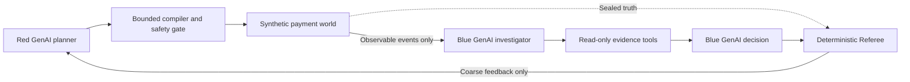

# SentinelLoop

**An open-model adversarial AI lab for payment security. Red GenAI designs the attack, Blue GenAI investigates and responds, and a neutral Referee measures who won.**

SentinelLoop is a working web prototype for the Mastercard Innovation Challenge 2026. It safely recreates GenAI-enabled fraud behavior inside a synthetic payment world; it does not connect to payment rails, contact real users, or generate operational fraud content.


## What the prototype demonstrates

1. A Red GenAI agent creates a bounded synthetic payment-fraud campaign from a source-grounded attack card.
2. A deterministic compiler and safety gate reject unsupported stages, parameters, identities and actions.
3. A simulator separates Blue-visible events from a sealed ground-truth record.
4. A Blue GenAI Investigator selects read-only evidence tools for every event.
5. A separate Blue Decision step chooses `allow`, `monitor`, `step_up`, `hold` or `block` and cites its evidence.
6. A deterministic Referee scores detection timing, protected value, false positives and customer friction.
7. Red receives only coarse declassified feedback and may adapt the next campaign.

There is no trained fraud classifier in the v2 Agent Arena. The core experiment is GenAI against GenAI, with deterministic simulation, validation and scoring around the models.

## Architecture and information boundaries



- **Red** sees researched attack cards, allowed mutations, difficulty and coarse feedback.
- **Blue** sees event types, synthetic attributes, visible history and tool evidence. It never receives the attack family, fraud label, stage ID or intervention answer key.
- **Referee** alone can join Blue's decisions to sealed truth.

Read [the detailed v2 architecture](docs/agentic-v2.md) for the contracts, scoring policy and deployment shape.

## Included attack families

| ID | Synthetic campaign | Main lifecycle coverage |
|---|---|---|
| `APP-01` | GenAI-amplified authorized push-payment scam | Pre-transaction and transaction |
| `ATO-01` | GenAI-assisted account takeover and rapid transfer | Pre-transaction through containment |
| `BEC-01` | Supplier impersonation and payment diversion | Pre-transaction and transaction |
| `MULE-01` | AI-coordinated mule fan-in and dispersal | Transaction and post-transaction |
| `SYNID-01` | Synthetic-identity onboarding and activation | Pre-transaction and early transaction |
| `EVADE-01` | Feedback-guided low-and-slow payment evasion | Transaction |

All identifiers, accounts, devices, beneficiaries, payments and timestamps are synthetic.

## Quick start: Ollama and Qwen

This is the recommended way to run SentinelLoop on a laptop. The application does **not** download or start a model automatically; install and start Ollama first.

### Prerequisites

- Python 3.11 or newer
- Git
- [Ollama](https://ollama.com/download) for macOS, Windows or Linux
- Enough local memory for the model you select

### 1. Clone the repository

```bash
git clone https://github.com/u367403_ual/mc-hackathon.git
cd mc-hackathon
```

### 2. Create the Python environment

macOS or Linux:

```bash
python3 -m venv .venv
source .venv/bin/activate
python -m pip install --upgrade pip
python -m pip install -r requirements.txt
```

Windows PowerShell:

```powershell
py -3.11 -m venv .venv
.\.venv\Scripts\Activate.ps1
python -m pip install --upgrade pip
python -m pip install -r requirements.txt
```

### 3. Install a Qwen model

The recommended default is Qwen 3.5 9B:

```bash
ollama pull qwen3.5:9b
```

The Ollama package is approximately 6.6 GB. For a smaller local download, use:

```bash
ollama pull qwen3.5:4b
```

On macOS and Windows, the Ollama application normally runs its server in the background. On Linux or a manual installation, start it in a separate terminal if needed:

```bash
ollama serve
```

Verify that the server and model are available:

```bash
ollama list
curl http://127.0.0.1:11434/v1/models
```

Ollama exposes an [OpenAI-compatible chat-completions API](https://docs.ollama.com/api/openai-compatibility), which is the interface SentinelLoop uses.

### 4. Confirm the model selected by SentinelLoop

With Ollama running and no model environment variables set:

```bash
python -m sentinelloop config
```

Expected shape:

```json
{
  "model_base_url": "http://127.0.0.1:11434/v1",
  "red_model_id": "qwen3.5:9b",
  "blue_model_id": "qwen3.5:9b",
  "structured_output_mode": "json_schema"
}
```

SentinelLoop prefers an installed `qwen3.5:9b`, then another Qwen 3.5 or Qwen Coder model, and finally any installed model whose name contains `qwen`.

### 5. Start the web application

```bash
python -m app.server
```

Open [http://127.0.0.1:8501](http://127.0.0.1:8501).

Use the HTTP address above. Opening `app/templates/lab.html` directly with a `file://` URL bypasses the Python service and cannot run a battle.

For your first test, select:

- Attack family: `ATO-01`
- Difficulty: `Medium`
- Feedback rounds: `1 round`

Then choose **Start agent battle**. A battle makes several sequential model calls, so a local CPU or smaller machine may take a few minutes.

## Explicit model selection

Automatic detection is convenient, but every model setting can be supplied explicitly. This also lets Red and Blue use different models.

macOS or Linux:

```bash
export MODEL_BASE_URL=http://127.0.0.1:11434/v1
export MODEL_API_KEY=ollama
export RED_MODEL_ID=qwen3.5:9b
export BLUE_MODEL_ID=qwen3.5:9b
export MODEL_STRUCTURED_OUTPUT_MODE=json_schema
python -m sentinelloop config
python -m app.server
```

Windows PowerShell:

```powershell
$env:MODEL_BASE_URL = "http://127.0.0.1:11434/v1"
$env:MODEL_API_KEY = "ollama"
$env:RED_MODEL_ID = "qwen3.5:9b"
$env:BLUE_MODEL_ID = "qwen3.5:9b"
$env:MODEL_STRUCTURED_OUTPUT_MODE = "json_schema"
python -m sentinelloop config
python -m app.server
```

Model guidance:

| Choice | When to use it |
|---|---|
| `qwen3.5:4b` | Faster or memory-constrained local demonstrations |
| `qwen3.5:9b` | Recommended balance for the full agent flow |
| A larger Qwen model | Stronger reasoning when the machine has sufficient GPU/memory capacity |
| Separate Red and Blue models | Comparative model experiments |

The configured server must implement `POST /v1/chat/completions`. `json_schema` is preferred. If a compatible server supports only JSON-object output, set `MODEL_STRUCTURED_OUTPUT_MODE=json_object`; use `prompt` only as a last-resort compatibility mode.

## vLLM and NVIDIA GPU deployment

SentinelLoop also includes a two-service Docker Compose configuration:

```text
Public web container → Private Qwen/vLLM container
```

Requirements:

- Docker with Compose
- An NVIDIA GPU
- NVIDIA Container Toolkit configured for Docker
- Sufficient GPU memory/model storage for `Qwen/Qwen3.5-9B`

Start both services:

```bash
export MODEL_API_KEY=choose-a-private-random-value
docker compose -f deploy/docker-compose.qwen.yml up --build
```

Then open [http://127.0.0.1:8501](http://127.0.0.1:8501). The first startup downloads the model and will take longer. The Compose file uses the official `vllm/vllm-openai` image; see the [vLLM Docker guide](https://docs.vllm.ai/en/stable/deployment/docker/) and [OpenAI-compatible server documentation](https://docs.vllm.ai/en/latest/serving/online_serving/openai_compatible_server/).

For a public deployment, expose only the web service. Keep vLLM private behind a network boundary or reverse proxy; an API key alone is not a complete perimeter.

## Run from the command line

With the model endpoint running:

```bash
python -m sentinelloop run \
  --attack-family ATO-01 \
  --difficulty medium \
  --rounds 1 \
  --seed 20260824
```

The complete audit record is written to `runs/agentic/latest.json` by default. The `runs/` directory is intentionally ignored by Git because it is generated locally.

## Debug in VS Code

The repository includes a VS Code configuration named **SentinelLoop Web — Guided Debug**.

1. Open the repository folder in VS Code.
2. Run **Python: Select Interpreter** and choose `.venv/bin/python` on macOS/Linux or `.venv\\Scripts\\python.exe` on Windows.
3. Open `app/server.py` and add a breakpoint inside `run_agent_lab()`.
4. Open **Run and Debug**, select **SentinelLoop Web — Guided Debug**, and press `F5`.
5. Open `http://127.0.0.1:8501`, configure one round, and start a battle.

The debug profile enables `SENTINELLOOP_TRACE=1`. Trace lines show the Red call, safety gate, simulation, Blue tool selection, decisions, legitimate controls, Referee scoring and feedback release. Flask's auto-reloader is disabled in this profile so breakpoints remain attached to one process.

## Tests

Run the current Agent Arena and information-boundary tests:

```bash
python -m unittest \
  tests.test_agentic_loop \
  tests.test_config \
  tests.test_dashboard -v
```

Run the Red compiler and safety-gate tests:

```bash
python -m unittest discover -s red_team_agent/tests -v
```

Run every deterministic test in the main test directory:

```bash
python -m unittest discover -s tests -v
```

The test agents use deterministic fake model gateways and do not download or call Qwen.

## Configuration reference

| Variable | Default | Purpose |
|---|---|---|
| `MODEL_BASE_URL` | Auto-detected Ollama or `http://127.0.0.1:8000/v1` | OpenAI-compatible model base URL |
| `MODEL_API_KEY` | `local-development` | Server-side bearer token; ignored by local Ollama |
| `RED_MODEL_ID` | Auto-detected Qwen or `Qwen/Qwen3.5-9B` | Red planner model |
| `BLUE_MODEL_ID` | Auto-detected Qwen or `Qwen/Qwen3.5-9B` | Blue investigator/decision model |
| `MODEL_STRUCTURED_OUTPUT_MODE` | `json_schema` | `json_schema`, `json_object` or `prompt` |
| `MODEL_TIMEOUT_SECONDS` | `120` | Timeout for one model call |
| `MODEL_MAX_OUTPUT_TOKENS` | `1400` | Maximum generated tokens per call |
| `RED_AGENT_TEMPERATURE` | `0.65` | Red planning diversity |
| `BLUE_AGENT_TEMPERATURE` | `0.15` | Blue decision consistency |
| `APP_HOST` | `127.0.0.1` | Web bind address |
| `PORT` | `8501` | Web port |
| `FLASK_DEBUG` | `0` | Flask development debugger |
| `SENTINELLOOP_TRACE` | `0` | Structured terminal trace output |

`.env.example` documents the same variables. Export them in the shell, configure them in your hosting platform, or supply them through Docker Compose. Never commit a real `.env` or API key.

## Repository map

```text
sentinelloop/        Red, Blue, evidence tools, simulator, Referee and orchestrator
red_team_agent/      Source-grounded attack cards, compiler and safety gate
app/                 Agent Arena web application and preserved legacy dashboard
deploy/              Web container and Qwen/vLLM Compose deployment
docs/                Architecture, taxonomy, schema and evaluation contracts
tests/               Closed-loop and information-boundary regression tests
src/                 Preserved v1 simulator and statistical baseline
deliverables/        Solution documents, diagrams and presentation material
```

## Safety model

SentinelLoop:

- Uses synthetic identifiers, events, payments and timestamps only.
- Does not create phishing messages, credentials, personal data, malware or payment-rail instructions.
- Does not send messages, access accounts, call financial systems or initiate payments.
- Rejects Red plans outside curated stage and parameter bounds.
- Keeps attack labels and intervention truth out of Blue prompts.
- Tests Blue against legitimate look-alikes to measure false positives and friction.

## Current roadmap

- Expand from static source-grounded cards to an approval-gated Threat Research Agent.
- Give Blue a post-episode Strategist that proposes and replay-tests defensive improvements.
- Replace the ambiguous Red `stage_emphasis` field with lifecycle phase, focus stage and adaptation goal tied to real bounded mutations.
- Add deeper entity-graph, behavioral-biometric, communication-risk and evidence-quality tools.
- Extend post-transaction coverage for payout and dispute abuse.

## Troubleshooting

### Connection refused at `127.0.0.1:8000`

No model was auto-detected and no explicit endpoint is reachable. Start Ollama, pull a Qwen model, then run:

```bash
python -m sentinelloop config
```

The reported base URL should be `http://127.0.0.1:11434/v1` for local Ollama.

### The page has no styling or cannot run a battle

Do not open `app/templates/lab.html` directly. Start `python -m app.server` and use `http://127.0.0.1:8501`.

### A battle takes a long time

Start with one round. Every event may invoke a Blue investigation call and a Blue decision call, and the legitimate controls are evaluated too. Model size and hardware have a large effect on runtime.

### Structured-output validation fails

Confirm the selected model supports reliable JSON output. Keep `json_schema` for current Ollama/vLLM releases; try `json_object` for a server that does not implement JSON Schema response formatting.

### Port 8501 is already in use

Stop the earlier server or choose another port:

```bash
PORT=8502 python -m app.server
```

## Research grounding

The attack catalog records source references with each family. The product direction is informed in part by Mastercard and Glenbrook's [Generative AI: Preparing Your Fraud Organization](https://www.mastercard.com/us/en/business/cybersecurity-fraud-prevention/cybersecurity/generative-ai-report.html), including its lifecycle framing, layered defense guidance, explainability requirements and iterative control-testing recommendations.
